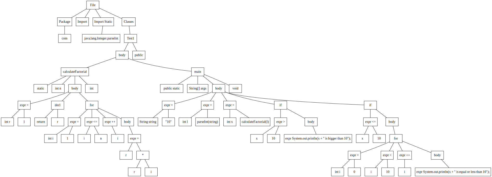

# java-ast

Supports parsing java code to AST for while and for loops, basic ifs (without else), expressions with numbers and 1 letter variables and declarations. 
Put java files into java folder and run the Main class, the associated dot files will appear in ASTs folder

Abstract Syntax Tree (AST): https://en.wikipedia.org/wiki/Abstract_syntax_tree

DOT file parsing: https://dreampuf.github.io

Example:
```java
package com;

import static java.lang.Integer.parseInt;

public class Test1{

    static int calculateFactorial(int n){
        int r = 1;
        for (int i = 1; i <= n; i++){
            r = r * i;
        }
        return r;
    }

    public static void main(String[] args){

        String string = "10";

        int l = parseInt(string);

        int x = calculateFactorial(l);

        if (x > 10) {
            System.out.println(x + " is bigger than 10");
        }

        if (x <= 10) {
            for (int i = 0; i < 10; i++) {
                System.out.println(x + " is equal or less than 10");
            }
        }
    }
}
```

Generated graph:

